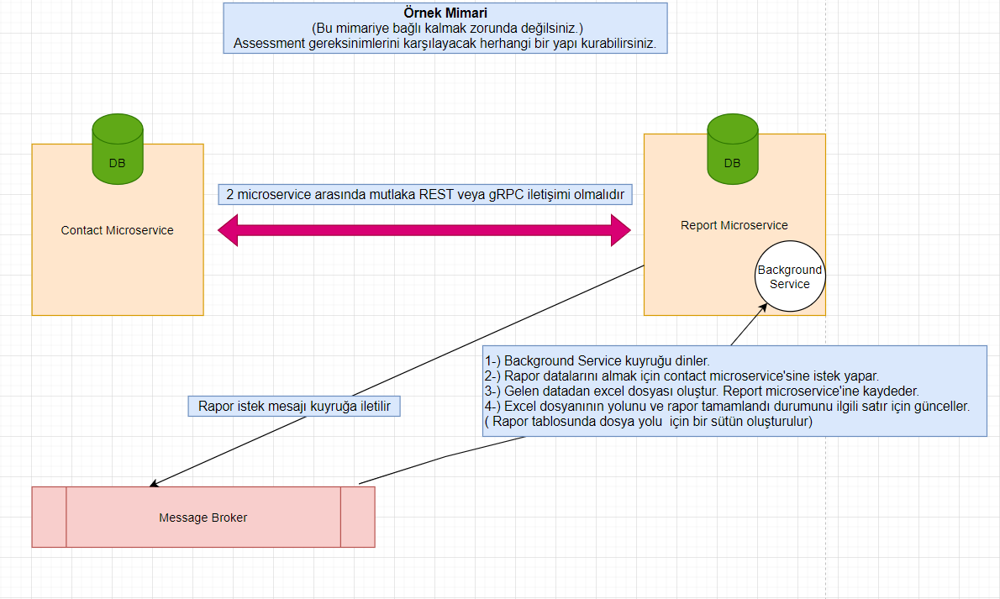

# assessment
<h1 align="center">Hi 👋, I'm Fatih</h1>
<h3 align="center">I am a backend developer from Turkiye</h3>

  

- 🔭 I’m currently working on [assessment](https://github.com/fthylmz2229/assessment)

- 👨‍💻 All of my projects are available at [https://github.com/fthylmz2229](https://github.com/fthylmz2229)

- 📝 I regularly write articles on [https://www.fatihyilmaz.com.tr](https://www.fatihyilmaz.com.tr)

- 📫 How to reach me **fatih@fatihyilmaz.com.tr**

<h3 align="left">Languages and Tools:</h3>

                

-----------------------------------------------

Proje için öncelikle PostgreSQL ve RabbitMQ ya ihtiyacımız var.
Bilgisayarınıza Docker kurulumu yaptıktan sonra docker-compose.yml dosyasını çalıştırdığınızda bu servisler ayağa kalkacaktır.
Varsayılan ayarlarla kurulduğunda uygulama çalışırken herhangi bir sorun olmayacaktır.

Uygulama 2 adet db kullanmaktadır.
Contact ve Report db leri.
Bu db ler code first yaklaşımı ile hazırlanmıştır.
2 db yi de migration ile oluşturabilirsiniz.

Oluşturduktan sonra;
 - Contact db de IletisimBilgiTipi tablosuna 1 - Telefon Numarası, 2 - E-mail Adresi, 3 - Konum bilgilerini ekleyin.
 - Report db de RaporDurum tablosuna 1 - Hazırlanıyor, 2 - Tamamlandı bilgilerini ekleyin.
 
 Solution da 2 adet API uygulaması mevcuttur.
 
 contact.api;
 - Kişi,
 - Kişiye Ait İletişim Bilgileri
 - İletişim Bilgi Tipleri tablolarını içermektedir.

• Rehberde kişi oluşturma
• Rehberde kişi kaldırma
• Rehberdeki kişiye iletişim bilgisi ekleme
• Rehberdeki kişiden iletişim bilgisi kaldırma
• Rehberdeki kişilerin listelenmesi
• Rehberdeki bir kişiyle ilgili iletişim bilgilerinin de yer aldığı detay bilgilerin
getirilmesi
• Rehberdeki kişilerin bulundukları konuma göre istatistiklerini çıkartan bir rapor
talebi

taleplerine cevap vermektedir.

report.api;
 - Rapor,
 - RaporDurum tablolarını içermektedir.

• Sistemin oluşturduğu raporların listelenmesi
• Sistemin oluşturduğu bir raporun detay bilgilerinin getirilmesi

taleplerine cevap vermektedir.

report.api bünyesinde RabbitMQ ile hazırlanmış Background Service içermektedir.
Bu servis RabbitMQ ye iletilen rapor oluşturma isteklerini dinler ve Exel rapor oluşturur.
Sonrasında ise Rapor tablosundaki kaydı günceller.

Mimari:

